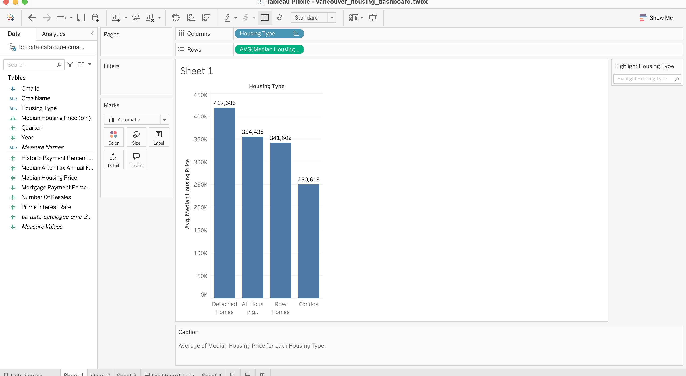
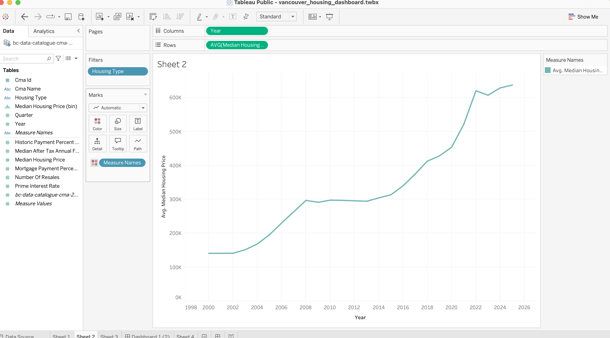

# British Columbia Housing Market Analytics

## Project Overview

This project analyzes housing affordability trends across British Columbia Census Metropolitan Areas (CMAs) using PostgreSQL, SQL, Python, Pandas, and Tableau.

The goal of this project is to simulate a real-world data analytics workflow, starting from raw datasets and progressing through data modeling, exploratory data analysis (EDA), business analytics, statistical analysis, data visualization, and dashboard development.

This project combines:

- Advanced SQL analytics
- Data cleaning and transformation
- Python and Pandas analysis
- Statistical exploration
- Data visualization
- Tableau dashboard development
- Business intelligence reporting

---

# Business Problem

Housing affordability has become one of the most important economic issues in British Columbia.

This project explores:

- How housing prices have changed over time
- Which housing types are most expensive
- Which regions have the highest mortgage burden
- The relationship between housing prices and economic indicators
- Long-term affordability trends
- Regional housing market differences

---

# Dataset Source

## BC Housing Affordability Dataset

Source:

https://catalogue.data.gov.bc.ca/dataset/b-c-housing-affordability

Files Used:

- bc-data-catalogue-cma-2025-q4.csv
- regions.csv
- yearly_interest_rates.csv

---

# Technology Stack

## Database

- PostgreSQL

## Programming

- Python
- Pandas

## Visualization

- Matplotlib
- Seaborn
- Tableau Public

## Development Tools

- VS Code
- Git
- GitHub

---

# Database Design

## housing_affordability

Primary analytical table containing:

- CMA information
- Housing types
- Housing prices
- Household income
- Mortgage burden metrics
- Resale statistics

## regions

Regional demographic information:

- Population
- Province
- Unemployment rate

## yearly_interest_rates

Economic indicators:

- Prime interest rate
- Average interest rate
- Inflation rate

---

# SQL Concepts Implemented

## Core SQL

- SELECT
- WHERE
- ORDER BY
- GROUP BY
- HAVING

## Joins

- INNER JOIN
- LEFT JOIN
- Multi-table analytical joins

## Window Functions

- ROW_NUMBER()
- RANK()
- DENSE_RANK()
- LAG()
- LEAD()
- FIRST_VALUE()
- LAST_VALUE()

## Subqueries

- Scalar Subqueries
- Correlated Subqueries
- EXISTS
- NOT EXISTS
- IN
- ANY
- ALL

## Business Analytics

- Regional Ranking
- Housing Affordability Analysis
- Trend Analysis
- Mortgage Burden Analysis
- Volatility Analysis
- Executive KPI Reporting

---

# Python & Pandas Analysis

The project was extended using Python and Pandas for exploratory data analysis.

## Data Processing

- CSV loading
- Data merging
- Data cleaning
- Data transformation

## Pandas Concepts Used

- DataFrames
- Filtering
- Sorting
- GroupBy
- Aggregations
- Pivot Tables
- Correlation Analysis

## Statistical Analysis

Correlation matrix was used to study relationships between:

- Median housing price
- Interest rates
- Inflation rate
- Population
- Unemployment rate
- Mortgage payment percent income

---

# Visualizations Created

## Matplotlib

### Housing Price Trends

- Long-term housing price growth
- Housing type comparisons

### Bar Charts

- Housing type analysis
- Regional comparisons

### Line Charts

- Housing price trends by year

### Boxplots

- Housing price distribution
- Outlier detection

---

## Seaborn

### Correlation Heatmap

Used to visualize relationships between:

- Housing prices
- Inflation
- Interest rates
- Population
- Unemployment
- Mortgage burden

---

# Tableau Dashboard

A business intelligence dashboard was developed using Tableau Public.

Dashboard components include:

## Housing Type Analysis

Average housing price by housing type.

## Housing Price Trend

Historical housing price growth from 2000–2025.

## Mortgage Burden by CMA

Comparison of affordability pressure across regions.

## Regional Summary Table

Interactive CMA-level metrics.

---

# Key Findings

## Housing Types

- Detached homes consistently have the highest housing prices.
- Condos remain the least expensive housing category.
- Row homes generally fall between condos and detached homes.

## Housing Trends

- Housing prices increased significantly between 2000 and 2025.
- Major growth occurred after 2015.
- Temporary slowdowns can be observed around:
  - 2008–2009
  - 2022–2023

## Mortgage Burden

- Several BC regions show a mortgage burden exceeding 40% of household income.
- This indicates increasing affordability challenges across many markets.

## Correlation Findings

### Strong Positive Correlation

- Median Housing Price ↔ Mortgage Payment Percent Income
- Correlation ≈ 0.88

### Moderate Positive Correlation

- Median Housing Price ↔ Inflation Rate
- Correlation ≈ 0.35

### Weak Positive Correlation

- Median Housing Price ↔ Population
- Correlation ≈ 0.26

### Weak Negative Correlation

- Median Housing Price ↔ Average Interest Rate
- Correlation ≈ -0.17

- Median Housing Price ↔ Unemployment Rate
- Correlation ≈ -0.14

---

# Tableau Screenshots

## Housing Type Analysis



## Housing Trend



## Mortgage Burden by CMA


## Dashboard


---

# Project Structure

```text
vancouver_housing_project/

├── data/
│   ├── bc-data-catalogue-cma-2025-q4.csv
│   ├── regions.csv
│   └── yearly_interest_rates.csv
│
├── notebooks/
│   └── 01_pandas_basics.ipynb
│
├── sql/
│   ├── schema/
│   └── eda/
│
├── tableau/
│   ├── vancouver_housing_dashboard.twbx
│   └── screenshots/
│       ├── dashboard.png
│       ├── housing_trend.png
│       ├── housing_type_analysis.png
│       └── mortgage_burden_by_cma.png
│
├── docs/
│
├── screenshots/
│
└── README.md
```

---

# Skills Demonstrated

- SQL Development
- Data Modeling
- Business Analytics
- Exploratory Data Analysis (EDA)
- Statistical Analysis
- Data Visualization
- Dashboard Development
- Tableau Public
- Pandas
- PostgreSQL
- Git Version Control
- Analytical Thinking

---

# Future Enhancements

Planned next steps:

- Advanced Pandas
- Time-Series Analysis
- Rolling Window Analytics
- Forecasting Models
- Predictive Analytics
- Tableau KPI Dashboards
- Power BI
- Geospatial Housing Analysis
- Machine Learning Models

---

# Author

**Sravanthi Gandi**

System Engineer | Data Analytics Enthusiast 

This project was developed as part of a structured learning journey covering SQL, Python, Pandas, Tableau, Business Analytics, and Data Visualization.